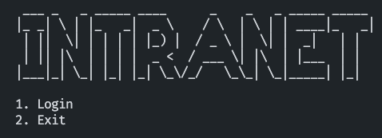

# OOP Final Project

## About Project
Project - university system **INTRANET**. We have classes (superclasses, subclasses, abstract classes), interfaces, enumerations, own exceptions, patterns, etc. - all techniques we have studied.
Before coding we designed our system - create an architecture using UML diagrams (Use case, Class Diagrams). You can find them in [UML Diagrams](https://github.com/diable201/OOP-Project-Intranet-System/tree/master/Uml_Diagrams) folder.
## Report
Also, you can find presentation and report about project in [Report](https://github.com/diable201/OOP-Project-Intranet-System/tree/master/Report) folder.
## Team Members
| Surname       | Name          | Github                                        |
| :-----------: |:-------------:| :-------------:                               |
| Seitbekov     | Sanzhar       | [Click Here](https://github.com/diable201)    |
| Makhmut       | Abulkhair     | [Click Here](https://github.com/Abulkhair23)  |
| Akhmetkan     | Azhar         | [Click Here](https://github.com/AzhrAkhmtkn)  |
## License
This repository is released under the [MIT license](LICENSE). In short, this means you are free to use this software in any personal, open-source or commercial projects. Attribution is optional but appreciated.